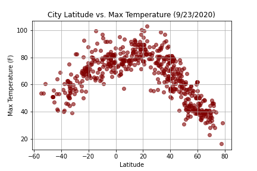
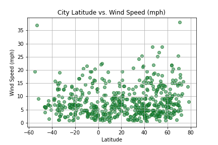

# python-APIs-challenge

## WeatherPy
### Objective:

Create a Python script to visualize the weather of 500+ cities across the world of varying distance from the equator. Then compare max temperatures, wind speed, humidity, and cloudiness to the latitude and discover any trends. 

#### Generating a List of Random Cities

A list of 500 + random cities was created by making two variables with the respective ranges of latitude and longitude, then zipping the lists together into a new list. The cities were found by utilizing citipy in a for loop to append the city names to an empty list. 

```python
lat_list = np.random.uniform(-90.00, 90.00, 1500)
lng_list = np.random.uniform(-180.00, 180.00, 1500)

coords_list = list(zip(lat_list, lng_list))

cities = []
countries = []

for coords in coords_list:
    
    city = citipy.nearest_city(coords[0], coords[1]).city_name
    country = citipy.nearest_city(coords[0], coords[1]).country_code
    
    if city not in cities:
        cities.append(city)
```

#### Perform API Calls

To start, a function was defined to extract data from the JSON output that included the name, lat, long, max temperature, humidity, cloudiness, wind speed, country, and data. The data was retrieved by using the OpenWeatherMap API in a for loop enumerating over the list of coordinates. A print log was established to print out the record number and city as the data was being processed. To not halt the retrieval, a try/except was implemented within the for loop and would print out if a city was not found. The data was extracted and appended to an empty list, then converted into a data frame and output to a CSV. 

```python
def extract_data(data):
    return {
        "name" : data["name"],
        "lat" : data["coord"]["lat"],
        "lng" : data["coord"]["lon"],
        "max_temp_f" : data["main"]["temp_max"],
        "humidity" : data["main"]["humidity"],
        "cloudiness" : data["clouds"]["all"],
        "windspeed" : data["wind"]["speed"],
        "country" : data["sys"]["country"],
        "date" : data["dt"]
    }
    
city_results = []

print("Beginning Data Retrieval")
print("-" * 30)

record_counter = 1

for i, city in enumerate(cities):
    
    if i > 600:
        record_counter += 1
    
    try:
        print(f"Processing Record {record_counter} | {city}")
        
        record_counter += 1
        
        data = requests.get(url = "http://api.openweathermap.org/data/2.5/weather", params = {
            "q": city,
            "appid": weather_api_key,
            "units": "imperial"
        }).json()
    
        cities_result = extract_data(data)
    
        city_results.append(cities_result)
        
    except KeyError:
        print("City Not Found. Skipping ...")
        pass
    
print("-" * 30)
print("Data Retrieval Complete")
print("-" * 30)

city_df = pd.DataFrame(city_results)

city_df.to_csv("cities_data.csv", index=False)
```

#### Plotting Weather Data

Next, plots were created from the data that was retrieved during the API calls to observe any weather trends when compared along the latitude for both the northern and southern hemispheres. Then additional plots were made, separating the latitudes into southern and northern hemispheres to compare the weather trends and linear regression respectively.







## VacationPy
### Objective:

Plan future vacations by using the previously made city weather csv to find locations with the most ideal weather. 

#### Create a Data Frame of Cities with Ideal Weather

This data frame was created by dropping rows with the max temperature over 90 or under 60, windspeeds over 10 mph, and cloudiness above 40%.

```python
hi_temps = df[df["max_temp_f"] > 90].index
low_temps = df[df["max_temp_f"] < 60].index
high_winds = df[df["windspeed"] > 10].index
cloudy = df[df["cloudiness"] > 40].index

df.drop(hi_temps, inplace=True)
df.drop(low_temps, inplace=True)
df.drop(high_winds, inplace=True)
df.drop(cloudy, inplace=True)
```

#### Obtain First Hotel in each City Using Google Places API

For vacation planning, the first step is always to look at hotels in each city. This was done using Google Places Nearby Search API. The location parameter takes a very specific format of coordinates, so a new column was added to the data frame by adding the latitude and longitude columns together, as strings, and separated by a comma. Similar to processing the weather APIs, first an extract function was define followed by a for loop iterating over the combined lat/lng column as a list. A record was printed for each set of coordinates in the try/except block to note when a hotel was found or not. The data was then extracted, appended to an empty list, and turned into a data frame.

```python
df["lat_lng"] = df["lat"].astype(str) + "," + df["lng"].astype(str)

lat_lng_list = df["lat_lng"].tolist()

hotels = requests.get("https://maps.googleapis.com/maps/api/place/nearbysearch/json", params={
    "key": g_key,
    "location": lat_lng_list,
    "radius": 5000,
    "keyword": "hotel"
}).json()

def extract_data(data):
    data = data["results"][0]
    return {
        "Hotel Name" : data["name"],
        "Lat" : data["geometry"]["location"]["lat"],
        "Lng" : data["geometry"]["location"]["lng"]
    } 
    
hotel_results = []

print("Beginning Data Retrieval")
print("-" * 30)

record_counter = 1

for coords in lat_lng_list:
    
    try:
        print(f"Processing Record {record_counter} | {coords}")
        
        record_counter += 1
        
        data = requests.get("https://maps.googleapis.com/maps/api/place/nearbysearch/json", params={
            "key": g_key,
            "location": coords,
            "radius": 5000,
            "keyword": "hotel"
        }).json()
    
        hotel_result = extract_data(data)
    
        hotel_results.append(hotel_result)
        
    except:
        print("No hotel found. Skipping ...")
        pass
    
print("-" * 30)
print("Data Retrieval Complete")
print("-" * 30)

hotel_df = pd.DataFrame(hotel_results)
```

#### Merging Data Frames and Plotting

To merge the city weather data frame with the new hotel data frame, first, the latitude and longitude columns needed to be rounded to the 0 decimal. Anything larger than 0 would not match up in the merge. The columns were then renamed for cleaner output in a map plot. 

```python
df = df.round({'lat': 0, 'lng': 0})
hotel_df = hotel_df.round({'Lat': 0, 'Lng': 0})

merged_df = pd.merge(hotel_df, df, how="left", left_on=["Lat", "Lng"], right_on=["lat", "lng"])
```

The merged data frame was plotted using Plotly and Mapbox with the latitude and longitude of the hotels. The heatmap was created by assigning the Humidity column to color which colors cities by humidity percentage. Hover data shows the coordinates, city, country, hotel name, and humidity for each plot point. 

```python
merged_df = merged_df.rename(columns={"name": "City", "humidity": "Humidity", "country": "Country"})

fig = px.scatter_mapbox(merged_df, lat="Lat", lon="Lng", color="Humidity", hover_data=[
    "Lat",
    "Lng",
    "City",
    "Country",
    "Hotel Name",
    "Humidity"
])

fig.show()
```


